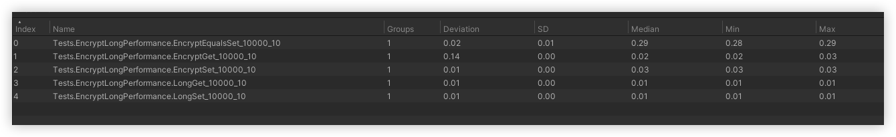

# 值类型内存加密

此库对常见的值类型做了比较完善的内存加密，可以抵御常见的内存搜索工具，本方案在 [CSEncryptType](https://github.com/nichos1983/CSEncryptType) 的设计基础上，针对 `堆内存` 消耗过大的问题进行了优化

具体使用如下：

```csharp
EncryptLong encrypt = 0;
encrypt.Set(100);
```

> 如果你比较关心其中的性能，可以打开 Test Runner，然后在 Performance 中查看每种加密类型与原生的性能差别，下图为 long 加密类型的性能对比



需要注意的是，对当前 struct 直接 set 性能非常接近原生，但是如果使用 `=` 赋值，会有一个数量级的性能差别，具体使用请根据自己的场景进行甄别